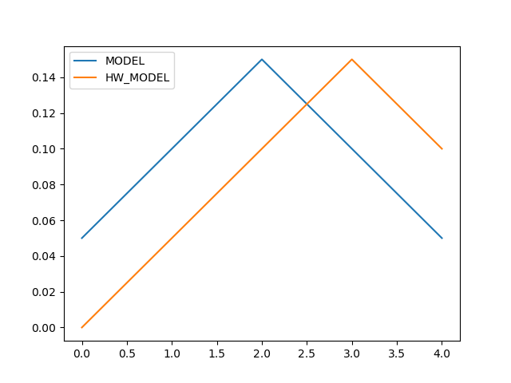
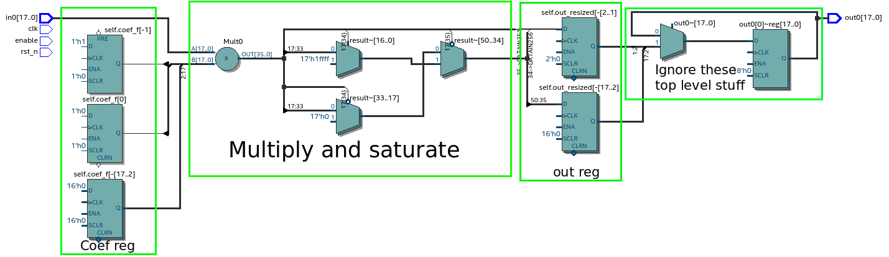

Tutorial:Basic usage
====================

In this tutorial we will write a simple fixed point multiplier.
It serves as a basic example of turning DSP models into HDL in sensible and testable way.

`Source code <https://github.com/petspats/pyha/blob/develop/examples/basic_usage/basic_usage.py>`__

`VHDL conversion <https://github.com/petspats/pyha/tree/develop/examples/basic_usage/conversion/src>`__

Model and unit-tests
--------------------

Lets follow the model and test-driven development, it goes like this:

- Write simplest possible model of what you want to do
- Experiment with it, dont throw away the experiments, rather turn them into unit-tests
- Profit (use the same tests to develop and verify HDL code)

Start by defining an model:

.. code-block:: python

    from pyha.common.hwsim import HW
    import numpy as np

    class BigFir(HW):
        def __init__(self, coef):
            self.coef = coef

        def model_main(self, input_list):
            # note that model works on lists
            return np.array(input_list) * self.coef

.. note::
    :code:`model_main` function is reserved for defining the model.
    It is not convertable to VHDL, we use it to verify RTL against this.

.. note::
    Pyha operates on classes, they must be derived from pyha.HW.

Next step is to write all the tests we can imagine, later we can use the same tests on RTL code.

One possible test, that pushes some data into the model and compares the output with the expected output.

.. code-block:: python

    def test_basic():
        from pyha.simulation.simulation_interface import SIM_MODEL, assert_sim_match, SIM_HW_MODEL, SIM_RTL, SIM_GATE
        dut = BigFir(coef=0.5)
        inputs = [0.1, 0.2, 0.3, 0.2, 0.1]
        expect = [0.05, 0.1, 0.15, 0.1, 0.05]

        assert_sim_match(dut, None, expect, inputs, simulations=[SIM_MODEL])

.. py:function:: pyha.simulation.simulation_interface.assert_sim_match(model, types, expected, *x, simulations=None, rtol=1e-05, atol=1e-09, dir_path=None, skip_first=0)

    Run bunch of simulations and assert that they match outputs.

    :param model: Instance of your class
    :param types: If :code:`main` is defined, provide input types for each argument, all arguments will be
     automatically casted to these types.
    :param expected: Expected output of the simulation. If None, assert all simulations match eachother.
    :param x: Inputs, if you have multiple inputs, use *x for unpacking.
    :param simulations: Simulations to run and assert:
    - SIM_MODEL: runs model ('model_main')
    - SIM_HW_MODEL: runs HW model ('main')
    - SIM_RTL: converts to VHDL and runs RTL simulation via GHDL and Cocotb
    - SIM_GATE: runs sources trough Quartus and simulates the generated netlist
    .. note:: If None(default), runs all simulations. SIM_HW_MODEL must be run if SIM_RTL or SIM_GATE are going to run.
    :param rtol: Relative tolerance for assertion. Look np.testing.assert_allclose.
    :param atol: Absolute tolerance for assertion. Look np.testing.assert_allclose.
    :param dir_path: Where are conversion outputs written, if empty uses temporary directory.
    :param skip_first: Skip first 'n' samples for assertion.

..
    RTD wont support Python 3.6 yet!
    automodule:: pyha.simulation.simulation_interface
    :members: assert_sim_match

.. note::
    If you use PyCharm you can run unit-tests by right clicking on the function name and selecting 'Run py.test..'
    You may need to set :code:`File-Settings-Tools-Python Integrated Tools-Default Test Runner = py.test`.
    You can also run PyTest from console :code:`$ pytest`

Hardware model
--------------
Assuming we have now enough knowledge and unit-tests we can start implementing
the Hardware model.

.. code-block:: python
    :emphasize-lines: 13,16,24,27
    :linenos:

    from pyha.common.const import Const
    from pyha.common.sfix import Sfix, resize, fixed_truncate
    from pyha.common.hwsim import HW
    import numpy as np

    class BigFir(HW):
        def __init__(self, coef):
            self.coef = coef

            # define output registers
            # bounds will be determined during simulation
            self.out_resized = Sfix()

            # constants
            self.coef_f = Sfix(coef, 0, -17)

            # uncomment this and quartus will optimize away multiplication (assuming coef=0.5)
            # self.coef_f = Const(Sfix(coef, 0, -17))

        def main(self, input):
            # this will also infer saturation logic
            # for registers you always assign to self.next
            self.next.out_resized = resize(input * self.coef_f, size_res=input,
                                           round_style=fixed_truncate)

            return self.out_resized

        def model_main(self, input_list):
            # note that model works on lists
            return np.array(input_list) * self.coef

In Line 13, we defined a register named :code:`out_resized`. It is using lazy-Sfix notation, meaning that the actual bounds are derived from the data you feed into the model.

.. note::
    All the class variables are interpreted as registers, unconvertable types like float or Numpy arrays will be ignord for conversion. All the assignments to registers go trough :code:`self.next`

Line 16 turns the floating point coef into fixed-point.

.. note::
    :code:`main` function is reserved for defining the HDL model, this is convertable to VHDL.
    This is the main entry to the model, you can call other functions if needed.

On line 23 resized result of multiplication is assigned to register. This also infers saturation logic.

Results are returned on line 25, multiple values can be returned in Pyha.

Testing
~~~~~~~
Only minor modifications are required to adapt the test function:

.. code-block:: python
    :emphasize-lines: 8, 10
    :linenos:

    def test_basic():
        from pyha.simulation.simulation_interface import SIM_MODEL, assert_sim_match, SIM_HW_MODEL, SIM_RTL, SIM_GATE
        dut = BigFir(coef=0.5)
        inputs = [0.1, 0.2, 0.3, 0.2, 0.1]
        expect = [0.05, 0.1, 0.15, 0.1, 0.05]

        assert_sim_match(dut,
                         [Sfix(left=0, right=-17)],
                         expect, inputs,
                         simulations=[SIM_MODEL, SIM_HW_MODEL])

On line 8 we added the input signature of our 'main' function and on line 10
we added a HW simulation instruction.

.. note::
    :code:`SIM_HW_MODEL` is Python based simulation, you can use debugger to see how your 'main' function is called. Debugger is quite an useful tool in Pyha designs since everything is fully sequentially executed.

.. note::
    You can write models in such way that input signature determines the output types. Your VHDL conversion will depend on this.

Upon running the test:

.. code-block:: python

    INFO:Running MODEL simulation!
    INFO:Running HW_MODEL simulation!
    ERROR:##############################################################
    ERROR:##############################################################
    ERROR:		"HW_MODEL" failed
    ERROR:##############################################################
    ERROR:##############################################################

    ... stack trace ...

.. code-block:: python

    AssertionError:
    Not equal to tolerance rtol=1e-05, atol=1e-09
    E
    (mismatch 100.0%)
    x: array([ 0.05,  0.1 ,         0.15,       0.05,       0.1])
    y: array([ 0.  ,  0.050003,     0.099998,   0.150002,   0.099998])

Hardware simulation failed, looking closely reveals the expected and
actual outputs are just delayed by 1.

Alternatively you can use a debug function:

.. py:function:: pyha.simulation.simulation_interface.plot_assert_sim_match(model, types, expected, *x, simulations=None, rtol=1e-05, atol=1e-09, dir_path=None, skip_first=0)

    Same arguments as :code:`assert_sim_match`. Instead of asserting it plots all the simulations.

..
    RTD wont support Python 3.6 yet!
    automodule:: pyha.simulation.simulation_interface
    :members: plot_assert_sim_match

It would output:

This is an standard hardware behaviour. Pyha provides special variable
:code:`self._delay` that specifies the delay of the model, it is useful:

- Document the delay of your blocks
- Upper level blocks can use it to define their own delay
- Pyha simulations will adjust for the delay, so you can easily compare to your model.

.. note:: Use :code:`self._delay` to match hardware delay against models

After setting the :code:`self._delay = 1` in the __init__, we get:

.. code-block:: python

    AssertionError:
    Not equal to tolerance rtol=1e-05, atol=1e-09
    (mismatch 80.0%)
    x: array([ 0.05,        0.1 ,       0.15,       0.05,        0.1 ])
    y: array([ 0.050003,    0.099998,   0.150002,   0.050003,    0.099998])

.. note:: :code:`rtol=1e-5` requires that ~5 digits after decimal point must match. :code:`rtol=1e-4` would require 4 digits to match.

Now values are aligned, but the tolerances are too strict, we are using fixed-point after all.
One way to solve this would be to add more bits to fixed-point type, for example :code:`Sfix(left=0, right=-19)`.
Better way is to set :code:`rtol = 1e-4`. We want to keep 18 bit fixed-point numbers
because Intel Cyclone FPGAs DSP blocks are of this size.

In general i am okay when simulations pass :code:`rtol=1e-3`.
You may need to adjust :code:`atol`, when failing numbers are close to 0.

Here is the final code that passes assertions:

.. code-block:: python
    :emphasize-lines: 20, 45
    :linenos:

    from pyha.common.const import Const
    from pyha.common.sfix import Sfix, resize, fixed_truncate
    from pyha.common.hwsim import HW
    import numpy as np

    class BigFir(HW):
        def __init__(self, coef):
            self.coef = coef

            # define output registers
            # bounds will be determined during simulation
            self.out_resized = Sfix()

            # constants
            self.coef_f = Sfix(coef, 0, -17)

            # uncomment this and quartus will optimize away multiplication (assuming coef=0.5)
            # self.coef_f = Const(Sfix(coef, 0, -17))

            self._delay = 1

        def main(self, input):
            # this will also infer saturation logic
            # for registers you always assign to self.next
            self.next.out_resized = resize(input * self.coef_f, size_res=input,
                                           round_style=fixed_truncate)

            return self.out_resized

        def model_main(self, input_list):
            # note that model works on lists
            return np.array(input_list) * self.coef

    def test_basic():
        from pyha.simulation.simulation_interface import SIM_MODEL, assert_sim_match, SIM_HW_MODEL, SIM_RTL, SIM_GATE
        dut = BigFir(coef=0.5)
        inputs = [0.1, 0.2, 0.3, 0.2, 0.1]
        expect = [0.05, 0.1, 0.15, 0.1, 0.05]

        assert_sim_match(dut,
                         [Sfix(left=0, right=-17)],
                         expect, inputs,
                         simulations=[SIM_MODEL, SIM_HW_MODEL],
                         rtol=1e-4)

RTL simulations
~~~~~~~~~~~~~~~

Add :code:`SIM_RTL` to the simulations list.

.. note::
    :code:`SIM_RTL` converts sources to VHDL and runs RTL simulation by using GHDL simulator.

In case you want to view the converted VHDL files, you can use :code:`dir_path` option.

Example:

.. code-block:: python

    assert_sim_match(dut,
                     [Sfix(left=0, right=-17)],
                     expect, inputs,
                     simulations=[SIM_MODEL, SIM_HW_MODEL, SIM_RTL],
                     dir_path='~/vhdl_conversion')

GATE simulation and Quartus
~~~~~~~~~~~~~~~~~~~~~~~~~~~

Add :code:`SIM_GATE` to the simulations list.

.. note::
    :code:`SIM_GATE` runs VHDL sources trough Quartus and uses the generated generated netlist for simulation. Use to gain ~full confidence in your design. It is slow!

Running the GATE simulation, will produce 'quartus' directory in :code:`dir_path`.
One useful tool in Quartus software is RTL viewer, it can be opened from Tools-Netlist viewers-RTL viewer.

RTL of this tutorial:

.. note:: Design will be optimized if you mark :code:`self.coef` as Const, Quartus will use shift instead of multiply.
